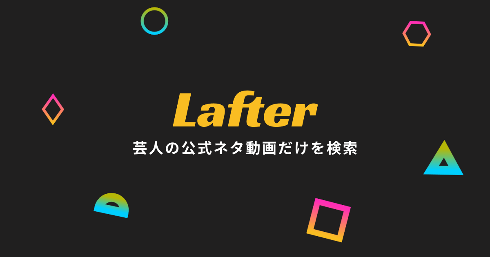
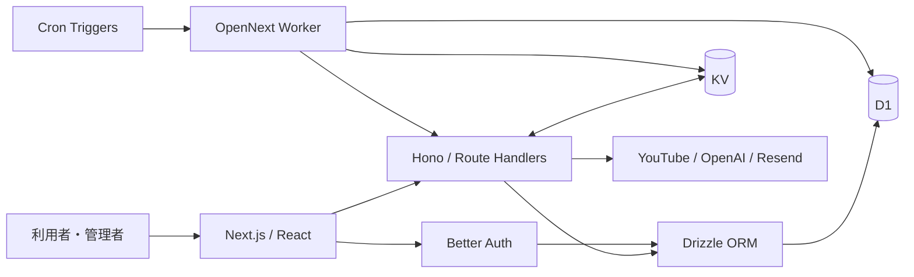

# Lafter

芸人や劇場の公式 YouTube チャンネルからネタ動画を探せる、個人開発の Web アプリです。無断転載を含む非公式動画が検索結果に混在する問題に対し、約580の公式チャンネルから収集した約3.6万本の動画を、主に AI とルールベースで分類して掲載しています。

**[Lafter を見る](https://lafter.day)**

担当範囲：企画、UI設計、フロントエンド、バックエンド、DB設計、インフラ、運用

## 技術選定と理由

| 技術 | 選定理由 |
| --- | --- |
| **Next.js 16 / React 19 / TypeScript** | 公開画面と管理画面を一つのアプリで構築し、動的メタデータや OGP などの SEO にも対応するため |
| **Hono / Zod** | Cloudflare Workers 上で軽量な API を構築し、外部入力を実行時に検証するため |
| **Cloudflare D1 / Drizzle ORM** | 関係性の多いデータを SQL で扱い、スキーマとクエリを型安全に管理するため |
| **Cloudflare KV** | 参照頻度の高い動画一覧のキャッシュと、公開 API のレート制限に利用するため |
| **Cloudflare Workers / OpenNext / Cron** | インフラ運用を抑えながら、Next.js と定期処理を同じ基盤で動かすため |
| **Better Auth** | D1 を利用した管理者のセッション認証を実装するため |
| **OpenAI API** | キーワードだけでは判断しにくい動画タイトルを文脈から分類するため |
| **YouTube Data API / RSS** | RSS でクォータ消費を抑えて収集し、Data API で動画の状態や統計情報を更新するため |
| **GitHub Actions / Wrangler** | ビルドから Cloudflare Workers へのデプロイまでを自動化するため |

## アーキテクチャ

公開画面のリクエストと外部 API を利用するデータ更新処理を分離しています。閲覧時は D1 または KV の保存済みデータを参照するため、YouTube Data API のクォータや応答時間が画面表示へ直接影響しません。

## 設計上のポイント

### データ配信とパフォーマンス

検索と正規データの保存には D1、最新・人気・ランダムなど参照頻度の高い一覧には KV を使用しています。D1 には公開状態、公開日、チャンネル、再生数などの検索条件に合わせた複合インデックスを定義し、キャッシュがない場合は D1 から取得できる構成にしています。

### 表記揺れに対応した検索

検索語を Unicode の NFC / NFD へ正規化し、制御文字の除去、連続スペースの圧縮、複数キーワードの AND 検索を行います。動画タイトルとチャンネル名に加えて別名テーブルも検索し、略称や異なる表記から同じチャンネルへ到達できるようにしました。

### データ収集と分類の自動化

RSS で新着を取得して API クォータを抑え、YouTube Data API で動画の存在や統計情報を更新します。Cron から収集、存在確認、LLM 分類、キャッシュ生成を異なる周期で実行し、重い処理はキューに分割しています。

分類にはキーワードによる高速な判定と LLM による文脈判定を組み合わせています。結果とともにモデル名、プロンプトバージョン、応答内容を保存し、分類方法を変更した際に比較・再評価できる構造にしました。

### セキュリティ

管理画面は Better Auth のセッション認証で保護し、管理 API にはセッションまたは共有シークレットを要求します。公開 API にも Origin 検証、リクエストサイズ制限、KV によるレート制限を設け、CSP や HSTS などのセキュリティヘッダーを設定しています。

### フロントエンドと SEO

レスポンシブなカード UI、無限スクロール、ページ内プレイヤーを実装し、検索から視聴までを一画面で完結させています。検索条件に応じた動的メタデータ、OGP、サイトマップを生成し、動画や芸人ページが検索エンジンから見つけやすい構成にしています。
